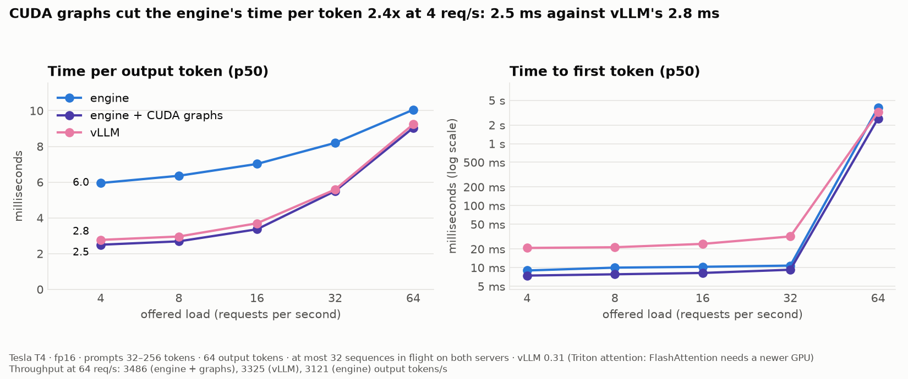
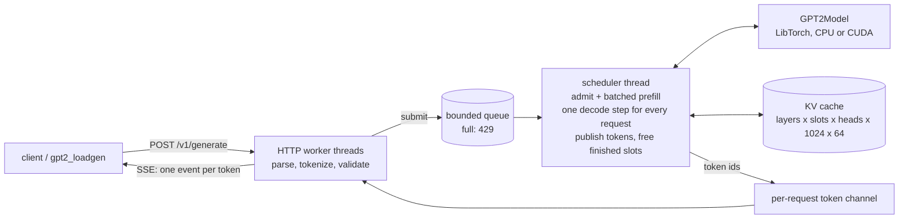

# GPT-2 inference engine

[](https://github.com/ujjwalr27/inference-engine/actions/workflows/ci.yml)

A GPT-2 serving engine written from scratch in C++17 on LibTorch: the forward pass, a KV cache,
continuous batching, CUDA graphs, an HTTP server that streams tokens, and a load generator to
measure all of it. No Python at serving time and no model code from Hugging Face; the weights are
exported once and loaded directly.

On a Kaggle Tesla T4 serving GPT-2 small in fp16, it matches vLLM on the same workload. It has
2–10% lower time per token, a 2.7–3.5× sooner first token and 5% more throughput past capacity
([details and caveats](#how-it-compares)).



## What is inside

- **Model:** GPT-2 forward pass on LibTorch tensors, checked against Hugging Face at every layer
  (`src/model`). Weights load from safetensors through a validating loader of its own (`src/io`).
- **KV cache:** preallocated once, one slot per request (`src/cache`). Finished requests are
  compacted out, so a decode step reads a view of the cache, never a copy.
- **Scheduler:** continuous batching on a single thread that owns the model and the cache
  (`src/scheduler`). Requests join and leave between decode steps. Prompts admitted in the same
  step are prefilled together as one padded batch. A static-batching policy is kept as the
  baseline.
- **CUDA graphs:** each decode step is replayed from a graph captured per (batch, length)
  bucket, so the CPU issues one launch instead of ~200 (`src/model/decode_graphs.cpp`).
- **Server:** HTTP with server-sent-event streaming, cancellation when the client hangs up, and
  429 back-pressure from a bounded queue (`src/server`). Text decodes incrementally without ever
  cutting a UTF-8 character.
- **Load generator:** open-loop Poisson arrivals, so queueing delay is measured, not hidden
  (`tools/loadgen.cpp`). It drives this engine or any OpenAI-compatible server (vLLM).
- **Correctness:** 88 tests. Batching must never change an answer: every request served
  alongside others must produce exactly what it produces alone.

## Architecture



The design rules:
- **One writer.** Only the scheduler thread touches the model and the KV cache, so neither needs
  a lock.
- **Big buffers are created once.** The KV cache, the pinned staging buffers and the CUDA graphs
  all exist before the first request; per-step tensors come from LibTorch's caching allocator.
- **Tokenization stays off the scheduler thread.** The scheduler only ever sees token IDs.

[IMPLEMENTATION.md](IMPLEMENTATION.md) has the full design, the correctness contract and every
measurement. [TODO.md](TODO.md) is the phase-by-phase log.

## Quick start with Docker (CPU)

```bash
docker build -t gpt2-engine .
```

The build compiles the engine, runs the test suite and exports GPT-2's weights from Hugging Face
into the image. Then:

```bash
docker run --rm -p 8080:8080 gpt2-engine
```

```bash
curl -N localhost:8080/v1/generate -d '{"prompt": "The meaning of life is", "max_tokens": 40, "stream": true}'
```

The image serves fp32 on the CPU. Arguments after the image name are passed to `gpt2_serve`, for
example `docker run --rm -p 8080:8080 gpt2-engine --slots 4`.

## Build from source (Linux or WSL2)

You need GCC or Clang with C++17, CMake 3.24+, Ninja, Rust (cargo, for the tokenizer), LibTorch
2.10 and, to export the weights, Python with `torch`, `transformers` and `safetensors`.
`scripts/setup_wsl.sh` installs all of it on Ubuntu.

```bash
git clone https://github.com/ujjwalr27/inference-engine.git && cd inference-engine
git submodule update --init third_party/tokenizers-cpp
bash scripts/setup_wsl.sh
source ~/venvs/gpt2-engine/bin/activate
python scripts/export_weights.py   # weights/: model, config, tokenizer
python scripts/reference.py        # weights/: Hugging Face outputs the tests compare against
bash scripts/build.sh              # configure, build, run the tests
```

Without the weights, the model tests skip themselves and the rest still run. The Docker
toolchain stage doubles as a build environment on any OS: build the stage once, then compile the
mounted checkout in it. Each compile job needs ~2 GB of memory, hence `-j 4`.

```bash
docker build --target toolchain -t gpt2-toolchain .
```

```bash
docker run --rm -v "$PWD:/src" -v gpt2-build:/build gpt2-toolchain bash -c "cmake -S /src -B /build -G Ninja -DCMAKE_PREFIX_PATH=/opt/libtorch && cmake --build /build -j 4 && ctest --test-dir /build"
```

## Run on a GPU (Kaggle T4)

In a Kaggle notebook with a T4 and internet access:

```python
!git clone -q https://github.com/ujjwalr27/inference-engine /kaggle/working/gpt2-engine
!git -C /kaggle/working/gpt2-engine submodule update --init -q third_party/tokenizers-cpp
%run /kaggle/working/gpt2-engine/scripts/kaggle_run.py
```

That builds against Kaggle's own PyTorch with CUDA, runs the tests (GPU ones included), runs the
micro-benchmarks and a first load test. Then, optionally:
- `scripts/kaggle_sweep.py` runs the request-rate, policy, slot and precision sweeps.
- `scripts/kaggle_baseline.py --servers engine,engine_graphs,engine_full,vllm` puts each engine
  configuration next to vLLM (or `huggingface`) under identical load.

Results land in `/kaggle/working/results` with their charts.

## HTTP API

**`POST /v1/generate`**

| Field | Type | Default | |
|---|---|---|---|
| `prompt` | string | | the text to continue, or: |
| `token_ids` | int array | | the prompt as GPT-2 token IDs (skips tokenization) |
| `max_tokens` | int | 64 | tokens to generate; prompt + `max_tokens` must fit in 1024 |
| `stream` | bool | false | stream tokens as server-sent events |
| `stop_on_eos` | bool | true | stop at GPT-2's end-of-text token |

Decoding is greedy.

Without streaming, the response is:

```json
{"text": "...", "token_ids": [...], "finish_reason": "max_tokens",
 "timings": {"queue_ms": 0.1, "ttft_ms": 9.2, "total_ms": 160.4, "prompt_tokens": 6, "output_tokens": 40}}
```

With streaming, each token arrives as `data: {"text": "...", "token_id": 123}`. A final event
carries `finish_reason` and `timings`, then `data: [DONE]`. A token that ends partway through a
UTF-8 character is held back until the character is complete.

Errors:
- **400:** bad JSON, empty prompt, or a request too long to ever fit.
- **429:** the queue is full, with `Retry-After`.
- **503:** the server is shutting down.

Closing the connection cancels the request and frees its slot at the next step.

**`GET /health`** returns `{"status": "ok"}`.

**`GET /stats`** returns the scheduler's counters:
- requests submitted, admitted, finished, cancelled and rejected;
- decode steps and the largest batch;
- where the scheduler's time went: prefill, decode and bookkeeping, in milliseconds.

**Server flags** (`gpt2_serve`):

| Flag | Default | |
|---|---|---|
| `--weights DIR` | `weights` | exported model, config and tokenizer |
| `--device cpu\|cuda`, `--dtype fp32\|fp16` | `cpu`, `fp32` | |
| `--slots N` | 8 | requests in flight at once (KV cache slots) |
| `--max-queue N` | 64 | waiting requests before 429 |
| `--prefill-budget N` | 512 | prompt tokens admitted per step, and the most padded tokens in one prefill pass; caps how long decoding pauses |
| `--policy continuous\|static` | `continuous` | static is the benchmark baseline |
| `--cuda-graphs`, `--no-cuda-graphs` | on for CUDA | replay decode steps from CUDA graphs |
| `--graph-length-step N` | 64 | cache lengths are rounded up to a multiple of this to pick a graph |
| `--solo-prefill` | off | prefill each request in its own pass, as before batched prefill |
| `--host`, `--port` | `127.0.0.1`, 8080 | |

## What each optimisation bought

All measured on a Kaggle T4 in fp16 unless marked CPU. Unless stated otherwise, the served
numbers use prompts of 32–256 tokens, 64 output tokens and open-loop Poisson arrivals.

| Change | Measured effect |
|---|---|
| KV cache (Phase 2) | 2.9× faster per token on CPU: 157.9 → 54.3 ms/token |
| Continuous batching instead of static | first token 95–97% sooner below capacity (9 vs 255 ms p50 at 8 req/s), whole requests 30–40% faster, same throughput |
| 32 slots instead of 1 | 16× the throughput (200 → 3,239 tokens/s), still rising at 32 |
| fp16 instead of fp32 | per-request latency 24% lower (427 vs 562 ms) at the same throughput; half the KV cache memory |
| One shared tokenizer instead of one per thread | served throughput 730 → 3,239 tokens/s; capacity 11 → 50 req/s |
| CUDA graphs | decode step 4.8 → 2.2 ms for one request; served time per token 6.0 → 2.5 ms; capacity +12% |
| Batched prefill | on CPU, 16 prompts: 4.8 s as one padded batch vs 5.0 s one by one; packing them into one row instead took 11.4 s (attention over the whole row). GPU numbers pending |
| 64-token graph buckets | not measured on a GPU yet (see [TODO.md](TODO.md)) |

The tokenizer row was a bug, found because the Hugging Face baseline looked too close. Each
worker thread loaded its own copy of `tokenizer.json`, about 200 ms each. Every claim made before
the fix was re-measured; IMPLEMENTATION.md keeps the record of what changed.

Charts: [continuous vs static](results/2026-10-05_t4/continuous_vs_static.png) ·
[latency vs load](results/2026-10-05_t4/ttft_vs_rate.png) ·
[slots vs throughput](results/2026-10-05_t4/slots_vs_throughput.png) ·
[decode step vs batch](results/2026-10-08_t4_graphs/decode_step_vs_batch.png) ·
[against Hugging Face](results/2026-10-05_t4/engine_vs_huggingface.png) ·
[against vLLM](results/2026-10-08_t4_graphs/engine_vs_vllm.png)

## How it compares

**Against Hugging Face `generate()`** (one request at a time, the naive baseline):
- 4.7× the throughput at 8 req/s.
- A first token in 7–9 ms at every load, where Hugging Face takes 16 ms idle and 37 s at 8 req/s
  once requests queue behind each other.

**Against vLLM 0.31** (one session, both capped at 32 sequences in flight):

| Load | Time per token: engine / vLLM | First token: engine / vLLM |
|---|---|---|
| 4 req/s | 2.5 / 2.8 ms | 7 / 21 ms |
| 32 req/s | 5.5 / 5.6 ms | 9 / 32 ms |

Past capacity, at 64 req/s, the engine produced 3,486 output tokens/s against vLLM's 3,325.

Read the vLLM comparison narrowly:
- **The model is small.** GPT-2 small has 124M parameters, so per-step overhead dominates, which
  is exactly what CUDA graphs remove.
- **vLLM is not at its best on a T4.** FlashAttention needs compute capability 8.0, so vLLM fell
  back to Triton attention.
- **Both servers were capped at 32 sequences in flight,** below vLLM's default.
- **The workload is uniform:** every request generated exactly 64 tokens.
- **It is one session.**

The fair claim is that the engine matches vLLM here, not that it beats vLLM in general.

## Honest notes

- **fp16 occasionally changes a greedy token.** When the top two logits are within fp16 rounding
  of each other, the token can differ from fp32. The tests allow a divergence only at a top-2 gap
  below 1.0 in fp16, and below 1e-3 in fp32. Every divergence seen so far was at a gap of 0 or
  0.06.
- **Decode on the T4 is launch-bound at small batches.** Without graphs, a step costs about 5 ms
  for 1 request or 16. CUDA graphs fix most of that. One corner was slower with them: batch 32
  with a 512-token cache, where 513 padded to 640. Finer buckets (64) are meant to fix it,
  measurement pending.
- **Greedy decoding only.** No sampling and no OpenAI-compatible endpoint (the load generator
  speaks OpenAI's API to drive vLLM, but the server does not).
- **One sequence per slot.** Every slot reserves the full 1024-token context, so the slot count
  is fixed by memory: 36 MiB per slot in fp16. There is no paged attention.
- **Prompts are prefilled whole.** A long prompt pauses every running request for one pass;
  the prefill budget only limits how many prompts join in one step. Chunked prefill would fix
  that.
- **Not hardened for the internet.** Plain HTTP, no authentication, no rate limits beyond the
  queue. It is a benchmarking server.

## Repository layout

```
src/
  io/          safetensors loader
  model/       config, layers, GPT-2 forward pass, generation, CUDA graphs
  cache/       KV cache
  scheduler/   requests, queue, continuous + static batching
  tokenizer/   tokenizers-cpp wrapper, incremental UTF-8-safe decoding
  server/      HTTP server
tools/         gpt2_serve, gpt2_loadgen, gpt2_bench, gpt2_generate, gpt2_forward
tests/         GoogleTest suite (CPU, GPU, threading)
scripts/       weight export, reference data, Kaggle runs, vLLM / Hugging Face baselines, charts
results/       benchmark CSVs and charts, one directory per session
```

## Testing

```bash
ctest --test-dir build --output-on-failure
```

The suite checks:
- every layer and the final logits against Hugging Face;
- cached generation against uncached, and both against Hugging Face's greedy text;
- the tokenizer against Python on 2,000 strings;
- batching and scheduling. Padded, packed and continuous batches must reproduce each request's
  solo output, and 100 staggered requests from 12 threads must each match their solo runs;
- the server: streaming, errors, overload and disconnects;
- the CUDA graphs against eager decoding (GPU only).

CI runs the full suite on CPU with the real weights, again under AddressSanitizer and UBSan, and
the threading tests under ThreadSanitizer.

## License

[MIT](LICENSE)
